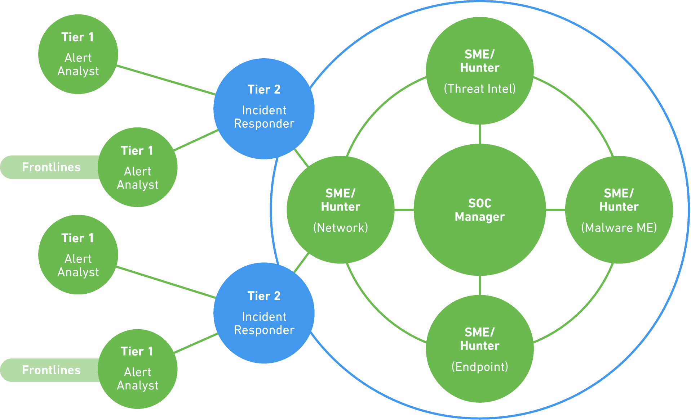

# Các thành phần và yếu tố trong mô hình SOC

## 1. Kiến trúc tổ chức của SOC:
Security Operation Center (SOC) là một phần quan trọng trong hệ thống bảo mật của các tổ chức, có vai trò giám sát, phân tích, và phản ứng với các sự kiện bảo mật trong thời gian thực. SOC là nơi tập trung các chuyên gia bảo mật và các công cụ hỗ trợ để đảm bảo an toàn và bảo mật cho hệ thống và dữ liệu của tổ chức. Trong báo cáo này, chúng ta sẽ tìm hiểu về kiến trúc tổ chức của SOC và các yếu tố quan trọng trong mô hình này.

## 2. Các thành phần của SOC

### 2.1. SOC Team
SOC Team là nhóm chuyên nghiệp chịu trách nhiệm quản lý và thực hiện các hoạt động bảo mật của SOC. Nhóm này gồm các chuyên gia bảo mật, nhân viên giám sát, và những người có kỹ năng phân tích cao. SOC Team chịu trách nhiệm về việc phát hiện, giám sát, và phản ứng với các sự kiện bảo mật.

### 2.2. SOC Manager
SOC Manager là người đứng đầu của SOC, có trách nhiệm điều hành và quản lý toàn bộ hoạt động của SOC. Là người chịu trách nhiệm về lập kế hoạch, phân công nhiệm vụ cho các thành viên trong SOC Team, và đảm bảo việc triển khai các quy trình và tiêu chuẩn bảo mật.

### 2.3. SOC Analysts
SOC Analysts là những chuyên gia bảo mật chịu trách nhiệm giám sát và phân tích các sự kiện bảo mật. Họ sử dụng các công cụ hỗ trợ và các kỹ thuật phân tích để đánh giá mức độ nghiêm trọng của các sự kiện và xác định liệu chúng có phải là cuộc tấn công hay chỉ là các hoạt động bình thường.

### 2.4. Incident Responders
Incident Responders là nhóm chuyên nghiệp chịu trách nhiệm phản ứng nhanh chóng và hiệu quả khi có các sự cố bảo mật. Họ triển khai các biện pháp khắc phục và ngăn chặn để giữ cho hệ thống an toàn sau khi xác định các mối đe dọa.

### 2.5. Threat Hunters
Threat Hunters là nhóm chuyên gia tìm kiếm các mối đe dọa tiềm tàng và các hoạt động tấn công chưa được phát hiện. Họ thực hiện các hoạt động phân tích chi tiết để phát hiện các mẫu tấn công mới và nghiên cứu để đối phó với chúng.

## 3. Cơ cấu và chức năng của các phòng ban trong SOC
### 3.1. SOC Analysts
SOC Analysts là nhóm chuyên nghiệp chịu trách nhiệm giám sát và phân tích các sự kiện bảo mật. Họ đảm bảo rằng hệ thống và mạng của tổ chức được theo dõi liên tục để phát hiện bất kỳ hoạt động bất thường nào. Chức năng chính của SOC Analysts bao gồm:

Giám sát hệ thống: SOC Analysts thực hiện giám sát liên tục của hệ thống và mạng để phát hiện các sự kiện đáng ngờ hoặc không bình thường.

Phân tích sự kiện: Khi phát hiện các sự kiện bảo mật, SOC Analysts thực hiện phân tích chi tiết để xác định mức độ nghiêm trọng và xem xét các hành vi và mẫu tấn công có thể liên quan.

Xác định các cuộc tấn công: SOC Analysts cố gắng xác định liệu các sự kiện bảo mật có phải là cuộc tấn công thực sự hay chỉ là các hoạt động bình thường.

Đưa ra các biện pháp giải quyết: Dựa trên phân tích, SOC Analysts đưa ra các biện pháp khắc phục để ngăn chặn các mối đe dọa và bảo vệ hệ thống.

### 3.2. SOC Managers
SOC Managers là người đứng đầu của SOC, có trách nhiệm quản lý và điều hành toàn bộ hoạt động của SOC. Chức năng chính của SOC Managers bao gồm:

Quản lý hoạt động: SOC Managers lãnh đạo và quản lý toàn bộ hoạt động của SOC, đảm bảo sự hiệu quả và chính xác trong giám sát và phản ứng.

Lập kế hoạch và phân công nhiệm vụ: SOC Managers lập kế hoạch hoạt động của SOC và phân công nhiệm vụ cho các thành viên trong nhóm để đảm bảo sự chuyên nghiệp và tối ưu hóa tài nguyên.

Thiết lập tiêu chuẩn bảo mật: SOC Managers đảm bảo tiêu chuẩn bảo mật được áp dụng và tuân thủ trong mọi hoạt động của SOC.

Báo cáo và giám sát: SOC Managers đưa ra báo cáo tổng quan về tình trạng bảo mật cho cấp quản lý và giám sát hiệu suất của SOC.

### 3.3. Incident Responders
Incident Responders là nhóm chuyên nghiệp chịu trách nhiệm phản ứng nhanh chóng và hiệu quả khi có các sự cố bảo mật. Chức năng chính của Incident Responders bao gồm:

Phân loại sự kiện: Incident Responders xác định và phân loại các sự kiện bảo mật để xác định mức độ nghiêm trọng.

Phản ứng nhanh: Khi có các sự cố bảo mật, Incident Responders triển khai các biện pháp khắc phục và ngăn chặn để giữ cho hệ thống an toàn.

Thu thập bằng chứng: Incident Responders thu thập các bằng chứng về các cuộc tấn công để hiểu rõ hơn về mối đe dọa và tăng cường khả năng ngăn chặn trong tương lai.

### 3.4. Threat Hunters
Threat Hunters là nhóm chuyên gia tìm kiếm các mối đe dọa tiềm tàng và các hoạt động tấn công chưa được phát hiện. Chức năng chính của Threat Hunters bao gồm:

Nghiên cứu và phân tích: Threat Hunters tiến hành các hoạt động nghiên cứu và phân tích chi tiết để phát hiện các mối đe dọa mới và tìm hiểu về chúng.

Tìm kiếm các mẫu tấn công: Threat Hunters tìm kiếm các mẫu tấn công mới và phát triển các biện pháp phòng ngừa và phản ứng.

Đối phó với các mối đe dọa tiềm tàng: Threat Hunters tìm kiếm các mối đe dọa tiềm tàng và đối phó với chúng trước khi chúng trở thành các cuộc tấn công thực sự.

## 4. Các quy trình và tiêu chuẩn hoạt động của SOC

### 4.1. Xác định (Identification):
Quá trình xác định trong SOC liên quan đến việc thu thập và phân loại các dữ liệu bảo mật từ các nguồn khác nhau. Điều này bao gồm việc thu thập dữ liệu từ các hệ thống, thiết bị, ứng dụng và mạng. Các dữ liệu này có thể bao gồm các bản ghi nhật ký, thông tin về sự kiện và hoạt động trên hệ thống.
Mục tiêu của quy trình này là xác định các sự kiện có thể đáng ngờ và có thể đại diện cho các mối đe dọa tiềm tàng hoặc các hoạt động bất thường trên hệ thống.

### 4.2. Phân loại (Classification):
Sau khi xác định các sự kiện bảo mật, quy trình phân loại được thực hiện để xác định mức độ nghiêm trọng và ưu tiên của từng sự kiện. Các sự kiện được phân loại dựa trên các tiêu chí như mức độ nguy hiểm, ảnh hưởng tiềm tàng và mức độ ưu tiên trong việc xử lý.
Quy trình phân loại đảm bảo rằng các sự kiện quan trọng nhất được xử lý và ưu tiên cao hơn, giúp tăng cường hiệu quả trong việc phản ứng và ứng phó với các mối đe dọa.

### 4.3. Phân tích (Analysis):
Quy trình phân tích trong SOC liên quan đến việc xem xét chi tiết các sự kiện bảo mật đã được xác định và phân loại. Các chuyên gia SOC sử dụng các công cụ và kỹ thuật phân tích để xác định nguồn gốc, mục tiêu và phạm vi của các mối đe dọa.
Phân tích chi tiết các sự kiện giúp nhận biết các mẫu tấn công, điểm yếu trong hệ thống và xu hướng các hoạt động độc hại, từ đó cung cấp thông tin quan trọng để ứng phó với các mối đe dọa.

### 4.4. Phản ứng (Response):
Quy trình phản ứng là giai đoạn quan trọng trong SOC, liên quan đến việc phản ứng kịp thời và hiệu quả khi có các sự cố bảo mật. Các nhóm phản ứng SOC đảm bảo rằng các biện pháp phản ứng được triển khai nhanh chóng để ngăn chặn sự lan truyền của mối đe dọa và giảm thiểu thiệt hại.
Các biện pháp phản ứng có thể bao gồm cô lập các hệ thống bị nhiễm mã độc, chặn các địa chỉ IP đáng ngờ hoặc ngừng các hoạt động độc hại khác trên hệ thống.

### 4.5. Giám sát (Monitoring):
Quy trình giám sát trong SOC đảm bảo rằng các biện pháp bảo mật đang hoạt động hiệu quả và theo dõi các hoạt động bảo mật liên tục. Việc giám sát được thực hiện để đảm bảo rằng các mối đe dọa không tái xuất hiện và hệ thống vẫn duy trì mức độ bảo mật cao.
Giám sát liên tục giúp phát hiện sớm các mối đe dọa mới và phản ứng kịp thời trong việc ngăn chặn các cuộc tấn công.